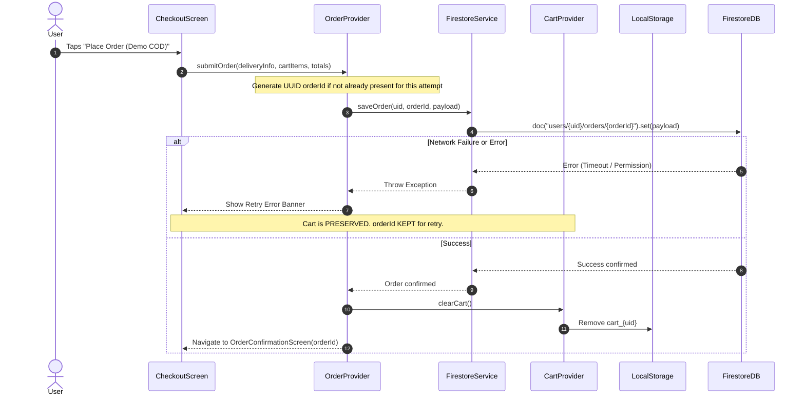
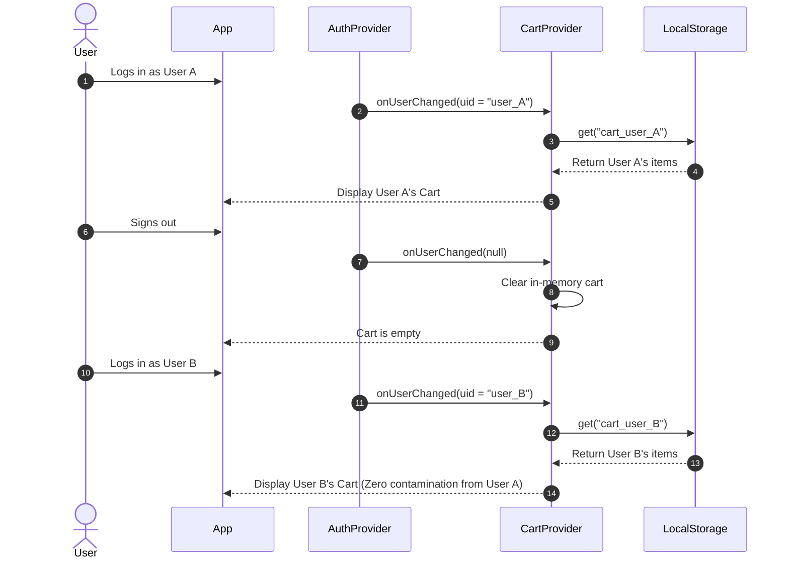

# Architecture Document
## Project: Flutter Shopping App (Task 04)
**Target Platforms:** Android, iOS  
**Package / Bundle ID:** `com.mudasir.shopping_app`  
**State Architecture:** Provider Pattern (Layered Clean Architecture)  
**Backend:** Node.js Serverless Functions (Vercel) + Brevo Email API + Firebase Admin SDK  
**Database & Auth:** Firebase Authentication + Cloud Firestore

---

## 1. High-Level System Architecture

```mermaid
graph TD
    subgraph Mobile Client [Flutter Application (Android & iOS)]
        UI[UI / Presentation Layer\nScreens & Reusable Widgets]
        PROV[State Management Layer\nProviders: Auth, Catalog, Cart, Order]
        SRV[Service Layer\nAuthService, CartStorageService,\nFirestoreService, CatalogService, ResetApi]
        MOD[Domain & Model Layer\nProduct, CartItem, Order, DeliveryInfo]
        
        UI --> PROV
        PROV --> SRV
        SRV --> MOD
    end

    subgraph Firebase Cloud
        FB_AUTH[Firebase Authentication]
        FB_STORE[Cloud Firestore\nusers/{uid}/orders/{orderId}]
    end

    subgraph Vercel Serverless Backend
        API[API Endpoints\n/api/send-reset-otp\n/api/verify-reset-otp]
        FB_ADMIN[Firebase Admin SDK]
        BREVO[Brevo API Client]
        
        API --> FB_ADMIN
        API --> BREVO
    end

    SRV -- Firebase SDK --> FB_AUTH
    SRV -- Firebase SDK --> FB_STORE
    SRV -- HTTPS REST --> API
```

---

## 2. Monorepo Repository Structure

The repository contains two distinct root directories alongside project documentation:

```
shopping-app/
├── docs/                             # Project documentation (committed to Git)
│   ├── PRD.md                        # Product requirements
│   ├── ARCHITECTURE.md               # System & software architecture
│   ├── DESIGN.md                     # UI/UX design specifications
│   ├── AGENTS.md                     # AI agent operational guidelines
│   └── TASK_TRACKER.md               # Phase-by-phase execution checklist
├── backend/                          # Vercel Serverless Backend for Auth / Brevo
│   ├── api/
│   │   ├── send-reset-otp.js         # Dispatches OTP via Brevo API
│   │   └── verify-reset-otp.js       # Verifies OTP and updates user password via Firebase Admin
│   ├── lib/
│   │   ├── firebaseAdmin.js          # Initialized Firebase Admin instance
│   │   └── brevoClient.js            # Brevo transactional email sender
│   ├── .env.example                  # Template for required environment variables
│   ├── .gitignore                    # Ignores .env and serviceAccountKey.json
│   ├── package.json                  # Dependencies: @getbrevo/brevo, firebase-admin, etc.
│   └── vercel.json                   # Vercel deployment configuration
├── shopping_app/                     # Flutter Mobile App (Android & iOS only)
│   ├── android/                      # Android platform files (package: com.mudasir.shopping_app)
│   ├── ios/                          # iOS platform files (bundle ID: com.mudasir.shopping_app)
│   ├── assets/
│   │   ├── catalog/products.json     # Bundled product catalog JSON (12+ items, 3 categories)
│   │   └── images/products/          # Local bundled product image assets
│   ├── lib/
│   │   ├── core/
│   │   │   ├── constants/            # App colors, styles, string constants, endpoints
│   │   │   ├── theme/                # Light / Dark theme configurations
│   │   │   └── utils/                # CurrencyFormatter (paisa to PKR), Pakistani phone validator
│   │   ├── models/                   # Pure immutable data models
│   │   │   ├── product.dart
│   │   │   ├── cart_item.dart
│   │   │   ├── order.dart
│   │   │   └── delivery_info.dart
│   │   ├── services/                 # Infrastructure and external API adapters
│   │   │   ├── auth_service.dart
│   │   │   ├── catalog_service.dart
│   │   │   ├── cart_storage_service.dart
│   │   │   ├── firestore_service.dart
│   │   │   └── password_reset_service.dart
│   │   ├── providers/                # State management and business logic
│   │   │   ├── auth_provider.dart
│   │   │   ├── catalog_provider.dart
│   │   │   ├── cart_provider.dart
│   │   │   └── order_provider.dart
│   │   ├── views/                    # UI screens
│   │   │   ├── auth/                 # Login, Sign Up, Forgot Password, Reset OTP
│   │   │   ├── catalog/              # Product Catalog with Search/Filter/Sort
│   │   │   ├── details/              # Product Details view
│   │   │   ├── cart/                 # Cart screen with quantity controls and totals
│   │   │   ├── checkout/             # Checkout form with demo banner & phone validation
│   │   │   └── orders/               # Order History & Order Confirmation
│   │   ├── widgets/                  # Modular, reusable presentation widgets
│   │   └── main.dart                 # App entry point, Provider wiring, and routing
│   ├── test/                         # Unit and Widget tests
│   │   ├── unit/
│   │   │   ├── currency_test.dart    # Paisa arithmetic and formatting
│   │   │   ├── cart_calculation_test.dart # Subtotal, delivery fee rules (200 / free >= 5000)
│   │   │   └── phone_validator_test.dart  # Pakistani phone number regex
│   │   └── widget/
│   ├── pubspec.yaml                  # Flutter dependencies
│   └── .gitignore                    # Standard Flutter / Dart / IDE ignore rules
├── firestore.rules                   # Production Cloud Firestore Security Rules
├── .gitignore                        # Global repository gitignore
└── README.md                         # Project setup, configuration, and documentation
```

---

## 3. Layered Component Responsibilities

### 3.1 Domain & Models (`lib/models/`)
- Immutable Dart classes with `fromJson` / `toJson` serializations.
- **Product:** `id`, `name`, `description`, `category`, `image`, `pricePaisa`.
- **CartItem:** `product`, `quantity` (guaranteed $1 \le q \le 10$).
- **OrderSnapshotItem:** `productId`, `name`, `unitPricePaisa`, `quantity`, `subtotalPaisa`, `image`.
- **DeliveryInfo:** `fullName`, `phone`, `streetAddress`, `city`.
- **Order:** `orderId`, `items`, `deliveryInfo`, `subtotalPaisa`, `deliveryPaisa`, `totalPaisa`, `status`, `createdAt`.

### 3.2 Services Layer (`lib/services/`)
- Encapsulates external I/O operations and third-party libraries.
- **AuthService:** Wraps `firebase_auth` (email/password sign-in, registration, sign-out, auth state changes stream).
- **CatalogService:** Loads and parses `assets/catalog/products.json`, provides failover for missing asset images.
- **CartStorageService:** Reads and writes JSON-serialized cart records to `SharedPreferences` partitioned by user identifier: `cart_${user.uid}`.
- **FirestoreService:** Communicates with Firestore collection `users/{uid}/orders`, executes idempotent document set operations using pre-generated `orderId`, and streams user order history.
- **PasswordResetService:** Dispatches HTTPS calls to the Vercel backend (`send-reset-otp` and `verify-reset-otp`).

### 3.3 State Management Layer (`lib/providers/`)
- Uses `ChangeNotifier` with Flutter's official `provider` package.
- **AuthProvider:** Tracks current `User?`, login status, auth loading states, and error alerts. Triggers `CartProvider.onUserChanged(uid)` upon login/logout.
- **CatalogProvider:** Maintains full product list, active category filter, search query string, and sort criteria (`priceAsc`, `priceDesc`, `default`). Computes filtered items efficiently via getter.
- **CartProvider:**
  - In-memory map of `productId -> CartItem`.
  - Enforces quantity clamp $[1, 10]$.
  - Calculates:
    $$\text{subtotalPaisa} = \sum (\text{item.pricePaisa} \times \text{item.quantity})$$
    $$\text{deliveryPaisa} = \begin{cases} 0 & \text{if items is empty} \\ 0 & \text{if } \text{subtotalPaisa} \ge 500{,}000 \text{ (PKR 5,000)} \\ 20{,}000 & \text{otherwise (PKR 200)} \end{cases}$$
    $$\text{totalPaisa} = \text{subtotalPaisa} + \text{deliveryPaisa}$$
  - Persists changes asynchronously through `CartStorageService`.
  - Clears state immediately on logout.
- **OrderProvider:**
  - Coordinates checkout submission with state flags: `isPlacingOrder`, `orderError`, `currentSubmissionOrderId`.
  - Preserves client order ID across retries for idempotency.
  - Fetches and caches order history snapshot list sorted descending by `createdAt`.

---

## 4. Key Business Logic Workflows

### 4.1 Order Placement & Idempotency Workflow



### 4.2 Account Switching & Cart Isolation



---

## 5. Security & Firestore Rules Architecture

Firestore rules strictly enforce data ownership at the database boundary:

```javascript
rules_version = '2';
service cloud.firestore {
  match /databases/{database}/documents {
    // Orders collection under individual user documents
    match /users/{userId}/orders/{orderId} {
      // Only the authenticated account owner may create or read their orders
      allow create: if request.auth != null 
                    && request.auth.uid == userId
                    && request.resource.data.subtotalPaisa is int
                    && request.resource.data.deliveryPaisa is int
                    && request.resource.data.totalPaisa is int
                    && request.resource.data.status == 'placed';
                    
      allow read: if request.auth != null && request.auth.uid == userId;
      
      // Updates and deletes from client are strictly denied
      allow update, delete: if false;
    }
  }
}
```

---

## 6. Serverless Password Reset Architecture (Backend)

1. **Mobile App:** User requests password reset for `user@example.com`.
2. **API Endpoint (`/api/send-reset-otp`):**
   - Validates email exists in Firebase Auth via `firebase-admin.auth().getUserByEmail(email)`.
   - Generates a cryptographically random 6-digit numeric OTP with 10-minute expiry.
   - Stores OTP hash in Firestore collection `_auth_resets/{email}` (accessible only by admin SDK).
   - Calls Brevo API (`POST https://api.brevo.com/v3/smtp/email`) using `BREVO_API_KEY` to send a clean, branded email containing the OTP code.
3. **API Endpoint (`/api/verify-reset-otp`):**
   - Receives email, OTP, and new password (must be $\ge$ 8 characters long).
   - Verifies OTP hash and expiry from Firestore.
   - Invokes `firebase-admin.auth().updateUser(user.uid, { password: newPassword })`.
   - Deletes OTP record.
   - Returns success response to mobile app.
